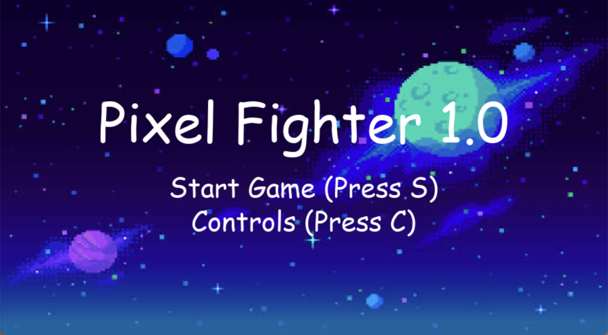
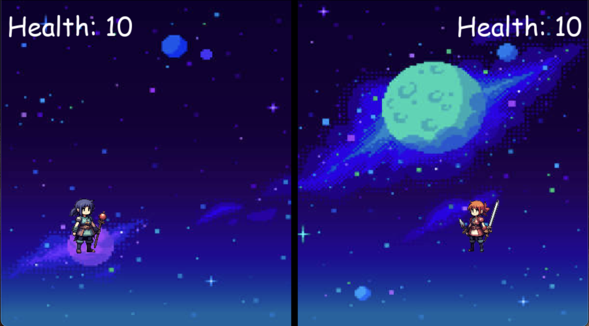

# Final Project Report

* Student Name: George Lin
* Github Username: lingeorge88
* Semester: FALL 2024
* Course: CS 5001


## Description 
<div style="text-align: center;">
    
    
</div>

Pixel Fighter (v1.0) is a 2-player shooting game developed using the Pygame library with straightforward game logic and controls. The gameplay revolves around two player-controlled characters firing projectiles at each other until one player's health is reduced to zero, providing a fast-paced and competitive experience.

The idea for this game stemmed from my interest with video game development and my desire to test my programming skills by creating a simple yet functional project. Pixel Fighter incorporates key concepts from CS 5001, such as object-oriented programming, control flow, logic, functions, and testing. I created the game’s sound effects, including firing and hitting, using Google’s Chrome Music Lab, while the character and attack sprites were generated with Stable Diffusion. The background music, which adds an immersive touch, was sourced from [PixelBay](https://pixabay.com/music/main-title-puzzle-game-loop-bright-casual-video-game-music-249201/).


## Key Features
This project emphasizes the integration of engaging visuals and audio to deliver an enjoyable user experience. By prioritizing straightforward game logic and a clear winning condition, the design ensures that players can focus on the gameplay itself without feeling overwhelmed by complex mechanics or controls. The balance between simplicity and interactivity helps make the game accessible and entertaining for a wide range of audience.
The codebase is thoughtfully organized in a modular structure, with a clear separation of concerns across files and functions. This approach enhances the maintainability of the code and facilitates future updates or feature expansions. By keeping individual components focused and well-documented, the project is not only easier to debug but also well-prepared to adapt to new ideas or improvements over time.

## Guide
To play the game, navigate to the project’s directory in your terminal or preferred IDE. Simply run the main.py file (inside src folder) to launch the game. Once started, you will enter the title screen with menu options along with visuals and sound effects. From there the user can view the controls of the game or start the game, where two players can engage in a fun and competitive experience. Player One uses W, A, S, D to move and Q to fire projectiles, while Player Two uses arrow keys for movement and M to fire projectiles. The objective is to hit your opponent while avoiding their projectiles. The game is won when the other player's health reaches 0. 


## Installation Instructions
Follow these steps to set up and run the project locally:

1. **Clone or Download the Repository**:
   - Clone the repository using the following command in your terminal:
     ```bash
     git clone https://github.com/Fa24-CS5001-Online-Lionelle/finalproject-lingeorge88.git
     ```
   - Alternatively, download the repository as a ZIP file from GitHub and extract its contents.

2. **Navigate to the Project Directory**:
> ⚠️**Important**: It is crucial to be in the **project directory** when running the game because the assets (images, sounds, etc.) are loaded using **relative paths**. Running the game from another directory will result in errors when loading these files.
   - Use the terminal or file explorer to move into the directory where the game files are located:
     ```bash
     cd finalproject-lingeorge88
     ```

3. **Install Dependencies Using `requirements.txt` (Recommended)**:
   - The project includes a `requirements.txt` file listing all the necessary dependencies. To install them all at once:
     ```bash
     pip install -r requirements.txt
     ```
     - **MacOS/Linux**:
       ```bash
       pip3 install -r requirements.txt
       ```

4. **Verify Pygame Installation**:
   - After installing dependencies, confirm that `pygame` is installed correctly by running:
     - **MacOS/Linux**:
       ```bash
       python3 -m pygame --version
       ```
     - **Windows**:
       ```bash
       python -m pygame --version
       ```
     This should output the installed version of `pygame`. If you see an error, ensure `pip` is set up correctly or re-install dependencies using step 3.

5. **(Alternative) Install Pygame Manually**:
   - If you prefer not to use `requirements.txt`, you can manually install the `pygame` library:
     - **MacOS/Linux**:
       ```bash
       pip3 install pygame
       ```
     - **Windows**:
       ```bash
       pip install pygame
       ```
6. **Run the Game**:
   - Inside the terminal, navigate to the `src` directory containing the game files:
   -
       ```bash
       cd src
       ```
    and execute the following command to launch the game:
     - **MacOS/Linux**:
       ```bash
       python3 main.py
       ```
     - **Windows**:
       ```bash
       python main.py
       ```
  **(Alternatively:) Execute file with 'run' using IDE**:
  - Right click on `main.py` file, select option to `run python file in terminal`


### Code Review

#### 1. Rendering Visuals with `WIN.blit`
**File**: [helpers.py](src/helpers.py)

```python
def draw_window(player_two, player_one, player_two_bullets, player_one_bullets, player_two_health, player_one_health):
    WIN.blit((BACKGROUND_IMAGE), (0, 0))  # Setting up the background
    pygame.draw.rect(WIN, BLACK, BORDER) # Draws border in the middle of the screen
    WIN.blit(RESIZE_PLAYER_ONE, (player_one.x, player_one.y))  # Positioning Player One
    WIN.blit(RESIZE_PLAYER_TWO, (player_two.x, player_two.y))  # Positioning Player Two
    pygame.display.update()
```
- `WIN.blit()` is a Pygame method to render surfaces (images or text) onto the game window (WIN) at specified positions. It takes 2 parameters, the surface to render and the (x,y) coordinates to render the surface. 
- The `draw_window()` function draws the background and game characters by utilizing WIN.blit and updates the display with pygame.display.update() to reflect these changes. This ensures smooth rendering of all game elements during each frame. Other functions

#### 2. Collision Detection with `rect.colliderect`
**File**: [projectile.py](src/projectile.py)
```python
def check_collision(self, target_rect):
    """Check if the projectile collides with the target."""
    return self.rect.colliderect(target_rect)
```
- `rect.colliderect()` is a Pygame built-in method that checks if two rectangle objects overlap. It takes a `target_rect` object that checks if the first object has overlapped with it
- `check_collision` simplifies collision detection between the character and the projectile by utilizing Pygame's built-in `.colliderect()` method.
- Returns `True` if two objects collide and `False` otherwise

#### 3. Event Handling with `pygame.event.post` and `pygame.USEREVENT` constant
**File**: [shooting_logic.py](src/shooting_logic.py)
```python
def handle_projectiles(
    player_one_projectiles, player_two_projectiles, player_one, player_two
):
    for projectile in player_one_projectiles[:]:
        projectile.move()
        if projectile.check_collision(player_two):
            pygame.event.post(pygame.event.Event(PLAYER_TWO_HIT))
            player_one_projectiles.remove(projectile)
        elif projectile.is_off_screen(WIDTH):
            player_one_projectiles.remove(projectile)

    for projectile in player_two_projectiles[:]:
        projectile.move()
        if projectile.check_collision(player_one):
            pygame.event.post(pygame.event.Event(PLAYER_ONE_HIT))
            player_two_projectiles.remove(projectile)
        elif projectile.is_off_screen(WIDTH):
            player_two_projectiles.remove(projectile)
```
- `pygame.event.post` adds a custom event to Pygame's event queue.
- It takes one Parameter: (event), A `pygame.event.Event` object that encapsulates event type and optional data.
- Example: `pygame.event.Event(PLAYER_ONE_HIT)` encapsulates a custom event type (PLAYER_ONE_HIT).
- Return Value: No return value. The event is added to Pygame's event queue.

**Files**: [settings.py](src/settings.py)

```
PLAYER_ONE_HIT = pygame.USEREVENT + 1
PLAYER_TWO_HIT = pygame.USEREVENT + 2
```
- pygame.USEREVENT is a constant provided by Pygame to define the starting point for custom events.
- In this game we are using it to define unique event types to represent specific game actions (by adding integers to pygame.USEREVENT):
  - `PLAYER_ONE_HIT`: Triggered when Player One is hit.
  - `PLAYER_TWO_HIT`: Triggered when Player Two is hit.
- We then post these events to the above `pygame.event.post()` method
- Lastly we can pass in these custom events into functions like `handle_hits()` function found in [game_logic.py](src/game_logic.py) to trigger desired game logic when certain events are posted:

```python
def handle_hits(event, player_two_health, player_one_health, sound_manager):
    if event.type == PLAYER_TWO_HIT:
        player_two_health -= 1
        sound_manager.play_hit_sound()
    # deducts health and plays hit sound when player one is hit
    if event.type == PLAYER_ONE_HIT:
        player_one_health -= 1
        sound_manager.play_hit_sound()
    return player_two_health, player_one_health
```
- In the above code block, when we trigger a `PLAYER_TWO_HIT` custom event, we will deduct the health of `PLAYER_TWO` and play a sound associated with getting hit by the projectile, and likewise for `PLAYER_ONE`.

#### 4. Managing Game Timing with `pygame.time.Clock`
**File**: [main.py](src/main.py)
```python
clock = pygame.time.Clock()
while run:
    clock.tick(FPS)
```
- `pygame.time.Clock()` manages the frame rate of the game.
- Takes one Parameter for `clock.tick`: FPS: The maximum number of frames to be processed per second.
- Return Value:
Returns the time in milliseconds since the last clock.tick call, which can be used for timing-related logic.

#### 5. Tracking movement with `pygame.K` 
**File**: [movement_logic.py](src/movement_logic.py)
```python
def player_one_handle_movement(keys_pressed, player_one):
    if keys_pressed[pygame.K_a] and player_one.x - VEL > 0:  # Move Left
        player_one.x -= VEL
    if keys_pressed[pygame.K_d] and player_one.x + VEL + player_one.width < BORDER.x:  # Move Right
        player_one.x += VEL
```
- `A pygame.key.ScancodeWrapper` is an object provided by Pygame that tracks the state of all keys. We can add game logic based on specific key input
- `player_one.x` represents the x-coordinate of the player rectangle object in Pygame. Here we are moving the character horizontally in different directions based on the key input (A or D).

#### 6. Implementing Game Audio with `pygamer.mixer.sound`
**File**: [game_sound.py](src/game_sound.py)
```python
pygame.mixer.init()
def play_player_one_fire():
    sound = pygame.mixer.Sound("sounds/player_one_fire.wav")
    sound.play()
```
- First needs to be initialized from the pygame module by calling `pygame.mixer.init()`
- `pygame.mixer.Sound()`: loads and plays sound effects.
- Parameters: file: Path to the sound file.
- Return Value: pygame.mixer.Sound returns a Sound object representing the loaded sound.
- `sound.play()` plays the loaded sound with optional parameters for volume and loop count. It does not return a value. We call this method to play our game sounds

### Major Challenges
This project presented several challenges, particularly in learning Pygame and mastering its built-in functions and modules. Designing robust game logic required careful planning, especially when writing unit tests for non-graphic and non-audio-related components. Additionally, creating most of the visual and audio assets from scratch and tailoring them to fit the game added a layer of complexity, as it required both creativity and technical precision.

Despite these obstacles, I was able to successfully implement the game logic and modular code with a clear separation of concerns, effectively utilizing various data types such as classes, tuples, and lists. Thorough documentation throughout the project ensured maintainability and clarity. Although there were initial struggles with adapting to a new framework and implementing the game logic, the final product is polished, featuring cohesive visuals, synchronized audio, and efficient, bug-free execution.

## Example Runs
See the following [Demo run video](/Assets/DemoRun_project.mp4) for an example run of the project, including start of game, end of game, player movement, etc. (Video needs to be played outside of the IDE for audio), or use this [Backup Youtube Link](https://youtu.be/D9IKvuRBKG0) to see the game in action

## Testing
How did you test your code? What did you do to make sure your code was correct? If you wrote unit tests, you can link to them here. If you did run tests, make sure you document them as text files, and include them in your submission. 

> _Make it easy for us to know you *ran the project* and *tested the project* before you submitted this report!_
- To ensure the reliability of functions (those not pertaining to graphics or visuals), I wrote unittests to verify their expected outputs. For some of these tests, I used mock or dummy objects to create instances of classes, simplifying the testing process and isolating the functionality being tested. For integration testing, I ran the game at various stages of development, testing a range of inputs to confirm that the visuals and audio worked as intended. I also checked that the game logic was correctly implemented, covering key aspects such as character movement, event handling, win conditions, menu options, and restart/exit functionality.
- All unittest outputs documented in the following .txt file:
- [unit test outputs](tests/tests.txt)
- The following unittests test for player input, character movement logic, shooting logic, class instances, checking winning conditions:
- [test_checkWinner.py](tests/test_checkWinner.py)
- [test_handleHits.py](tests/test_handleHits.py)
- [test_handleProjectiles.py](tests/test_handleProjectiles.py)
- [test_playerOneMovement.py](tests/test_playerOneMovement.py)
- [test_playerTwoMovement.py](tests/test_playerTwoMovement.py)
- [test_projectileClass.py](tests/test_projectileClass.py)
- [test_shootingLogic.py](tests/test_shootingLogic.py)
- Integration testing (audio/visual/overall game execution) by video:
- [Testing video](/Assets/DemoRun_project.mp4)
- [Backup Youtube Link](https://youtu.be/D9IKvuRBKG0)


## Missing Features / What's Next
In future updates, I would like to implement a character selection screen with a wider variety of characters for players to choose from, as well as introduce a single-player mode where users can compete against a computer-controlled character. Expanding the game’s features is another priority, including adding elements such as power-ups, special attacks, and other dynamic mechanics to enhance gameplay. I also aim to explore Pygame’s additional built-in methods to streamline development and improve functionality.

From a coding perspective, I was unable to implement a dedicated Player class due to the complexity of the required scope and logic. Instead, I primarily relied on functional programming to handle the game logic. In the future, I hope to encapsulate character-specific methods within a Player class, similar to how I structured the Projectile and SoundManager classes. This approach would improve the organization, scalability, and maintainability of the code as the game evolves.

## Final Reflection

I am pleased with the progress I have made in this course, particularly in mastering the fundamentals of programming, such as breaking tasks into smaller, manageable steps to build towards more complex solutions. Throughout the course, I enhanced my version control practices by leveraging my prior experience with Git and GitHub, reinforcing the importance of maintaining an organized workflow. I also gained a deeper appreciation for writing tests, drawing flow and logic diagrams, utilizing different data types and accounting for edge cases in my code, which have become integral parts of my coding process.

Looking ahead, I hope to continue building projects in Python across various domains to expand my skills and stay updated with the language’s ongoing developments. Python’s straightforward syntax and robust support for different data types make it an excellent tool for studying data structures and algorithms. My key takeaway from this course is that planning, documenting, and testing code are just as crucial as writing it. This experience has also given me confidence that with consistent effort and small, progressive steps, I can master new concepts and tackle challenges effectively, as demonstrated by my journey in creating this final project.